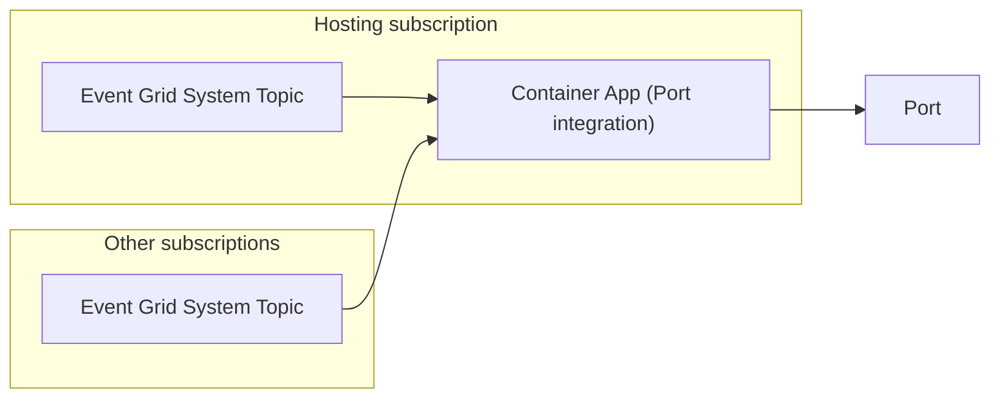
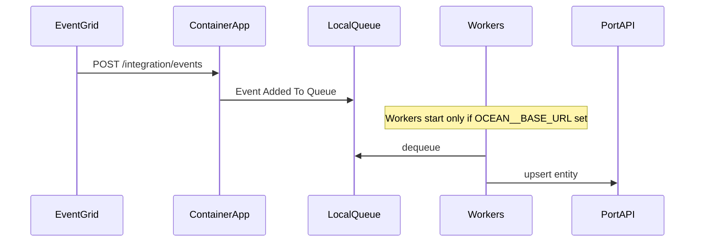

# Azure integration with real-time events (Terraform)

Deploys Port's Azure integration on Azure Container Apps and wires up **Azure Event
Grid** so your Port catalog updates in real time when Azure resources change. It
supports ingesting live events from **multiple subscriptions**.



The integration creates one Event Grid System Topic in the hosting subscription by
default. If the subscription already has a `Microsoft.Resources.Subscriptions`
system topic (common in long-running environments), pass it in instead — see
[Use an existing Event Grid system topic](#use-an-existing-event-grid-system-topic).
Additional subscriptions are added with a few lines (see
[Add another subscription](#add-another-subscription)).

## Prerequisites

- [Terraform](https://developer.hashicorp.com/terraform/install) >= 1.15.0
- An Azure subscription and permission to create resources in it (`az login`)
- Port credentials: [client id and secret](https://docs.port.io/build-your-software-catalog/custom-integration/api/#get-api-token)
- Terraform Cloud (or another state backend — see the commented `backend "azurerm"`
  block in `terraform/terraform.tf`)

## Quick start

```bash
az login

export TF_VAR_port_client_id="..."
export TF_VAR_port_client_secret="..."
export TF_VAR_hosting_subscription_id="$(az account show --query id -o tsv)"

cd terraform
cp environments/example.integration.tfvars environments/integration.tfvars
terraform init
terraform plan  -var-file=environments/integration.tfvars
terraform apply -var-file=environments/integration.tfvars
```

> State is stored in Terraform Cloud. Set `TF_CLOUD_ORGANIZATION` and
> `TF_WORKSPACE`, or run `terraform login`. To use an Azure Storage backend
> instead, see the commented `backend "azurerm"` block in `terraform.tf`.

Changing `location` or `integration_identifier` destroys and recreates the
module resource group (and nested resources). The azurerm provider is configured
to allow that cleanup; if a destroy fails mid-flight with leftovers in the RG,
re-run apply, or delete the stuck Container Apps Environment / RG in Azure and
apply again.

After the first apply, set `ocean_base_url` so live-event workers start — see
[Troubleshooting](#troubleshooting).

## Use an existing Event Grid system topic

Most customers install into a subscription that has been running for a while and
may already have a subscription-level Event Grid system topic. Reuse it instead
of creating a second one.

Requirements:

- Topic type must be **`Microsoft.Resources.Subscriptions`** (subscription
  resource events). Other topic types will not deliver the events this
  integration expects.
- Terraform still creates Event Grid **event subscriptions** (webhooks) on that
  topic. Your credentials need permission to add subscriptions there.
- Live-event workers still need [`ocean_base_url`](#live-events-queued-but-nothing-reaches-port).

In your env tfvars:

```hcl
event_grid_system_topic_name = "my-subscription-events"
# Required when the topic is not in the integration resource group:
event_grid_resource_group    = "my-event-grid-rg"
```

Leave both unset (the default) to let the module create a new system topic in the
integration resource group.

## Add another subscription

To also receive live events from a second subscription:

1. In `terraform.tf`, uncomment the aliased `azurerm` provider and set its
   `subscription_id`.
2. In `main.tf`, uncomment the `live_events_extra` module block and set its
   `subscription_id`.

Repeat with a new alias name for each additional subscription. Your credentials
need permission to create Event Grid resources in every target subscription.

## Deploying via GitHub Actions

Enabling this project inside a fork of this catalog? Copy only `.github/` to the
repository root and see the [repo README](../../../README.md) for that flow.
After enablement (or when this directory is your repository root), the workflow
at `.github/workflows/integration-azure-tf.yml` runs `plan` on pull requests and
`apply` on push, per environment (`integration`, `staging`, `production`).

The workflow ships pointed at this catalog's nested layout, so it runs as-is from
a fork. When this directory becomes your repository root, set the `TF_DIR`
repository variable to `terraform` and change the `on.push` / `on.pull_request`
path filters to `terraform/**` to match.

`AZURE_CLIENT_ID` is an **app registration** used by GitHub Actions to run
Terraform. It is separate from the Container App managed identity the Ocean
module creates for the running integration (that identity gets read permissions
via `action_permissions_list`).

### First-time Azure setup (OIDC)

Preferred: apply the one-time bootstrap under [`bootstrap/`](bootstrap/) locally
(not run by CI). Your user needs permission to create app registrations and
assign subscription roles.

```bash
az login
cd bootstrap
terraform init
terraform apply -var="subscription_id=$(az account show --query id -o tsv)"
```

Copy the outputs into the GitHub `integration` environment:

- `azure_client_id` → `AZURE_CLIENT_ID`
- `azure_tenant_id` → `AZURE_TENANT_ID`
- `azure_subscription_id` → `AZURE_SUBSCRIPTION_ID`

What that Terraform creates (same steps if you prefer the portal):

1. **Microsoft Entra ID → App registrations → New registration** — create an
   app (e.g. `port-azure-tf`), single tenant, no redirect URI.
2. Copy the **Application (client) ID** → `AZURE_CLIENT_ID`.
3. Copy **Directory (tenant) ID** and your **Subscription ID** →
   `AZURE_TENANT_ID` / `AZURE_SUBSCRIPTION_ID`.
4. On the subscription (**Access control (IAM)**), grant the app
   **Contributor** and **User Access Administrator** (needed so Terraform can
   create resources and assign roles to the Container App identity).
5. On the app → **Certificates & secrets → Federated credentials**, add a
   GitHub Actions credential: org `<your-org>`, repo `<your-repo>`, entity type
   **Environment**, name `integration`, credential name `gha-deploy` (subject
   `repo:<your-org>/<your-repo>:environment:integration`).

### GitHub environment config

Configure each GitHub environment with:

- **Variables:** `TFC_ORGANIZATION`, `AZURE_TENANT_ID`, `AZURE_SUBSCRIPTION_ID`,
  `AZURE_CLIENT_ID`, `PORT_CLIENT_ID`
- **Secrets:** `TF_API_TOKEN`, `PORT_CLIENT_SECRET`
- **Deployment branches and tags (required):** Settings → Environments →
  `<env>` → enable **Selected branches and tags**, and allow only the protected
  trunk branch (`main`) or an equivalent protected-branch pattern. Do this for
  every environment used to apply infra (`integration`, `staging`,
  `production`).

  The Azure federated credential subject is scoped by environment name only
  (`repo:…:environment:<env>`), not by ref — GitHub's OIDC `sub` claim cannot
  combine `environment:` and `ref:` when the job declares an environment. The
  deployment branch policy is therefore the control that prevents non-trunk
  branches (including PR branches) from using that environment's OIDC trust
  and secrets.

`TFC_WORKSPACE_SLUG` and `TFC_WORKSPACE_TAGS` are set in the workflow itself, so
another integration can share the same GitHub environment by copying the workflow
and changing those two lines.

Azure auth defaults to OIDC. To use a service principal secret instead, set
`USE_AZURE_STATIC_CREDENTIALS: "true"` in the workflow and add an
`ARM_CLIENT_SECRET` secret.

## Blueprints and mappings

`initialize_port_resources` is `false` by default, so blueprints and mappings are
managed as code and promoted through the normal Port config pipeline — see
[`port-resource-promotion/port-cli`](../../port-resource-promotion/port-cli).
Set it to `true` to let the integration seed its own defaults instead.

## Troubleshooting

### Live events queued but nothing reaches Port

Event Grid can deliver to the Container App without this, but Ocean **does not
start webhook queue workers** unless `OCEAN__BASE_URL` is set. Without it you
see `POST /integration/events` → 200 → `Event Added To Queue`, then silence —
no Port upserts.



This stack sources Port's module
`port-labs/integration-factory/ocean//examples/azure_container_app_azure_integration`.
That module does **not** set `OCEAN__BASE_URL`, and it wires Event Grid to the
revision FQDN (`container_app_latest_fqdn`), which changes on every Container App
update. Regressed in Azure integration `0.1.371+` (reproduced on `0.1.378`).

Until upstream sets a stable ingress FQDN and `OCEAN__BASE_URL` on the Container
App, operators must set it with a two-step apply:

1. Apply once (as in [Quick start](#quick-start)) so the Container App and Event
   Grid exist.
2. Read the **stable** hostname (not `container_app_fqdn`, which includes a
   revision suffix that changes on every app update):

   ```bash
   terraform output -raw container_app_fqdn_stable
   ```

3. Set in the env tfvars (or `TF_VAR_ocean_base_url`) — **https + FQDN, no path**:

   ```hcl
   ocean_base_url = "https://<container_app_fqdn_stable>"
   ```

4. Apply again so the revision gets `OCEAN__BASE_URL`.
5. Confirm in Container App logs at startup that you do **not** see
   `No base URL provided, or webhook processing is disabled… skipping webhook processing`.
   Create a resource group and check Port for the entity without a manual resync.

CI keeps working once `ocean_base_url` is committed in the env tfvars.

**Apply caveat:** Setting `ocean_base_url` updates the Container App and creates a
new revision. Upstream still points Event Grid at the **revision** FQDN
(`container_app_latest_fqdn`), so that apply often fails with Terraform's
`Provider produced inconsistent final plan` on the Event Grid subscription
webhook URL. Re-run apply; the second run usually succeeds. This repo's
`container_app_fqdn_stable` / `live_events_webhook_url` outputs are for operators
and docs only — they do **not** change how the Port module wires Event Grid.
