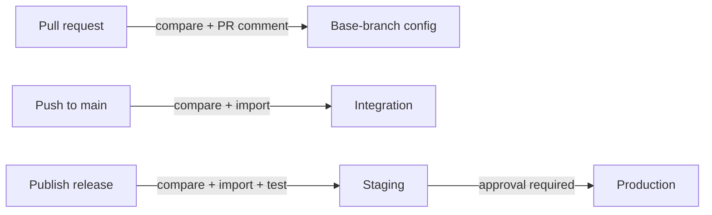

# Port resource promotion (Port CLI)

Promote your Port configuration through environments the same way you ship code: review a diff on a pull request, deploy to Integration on merge, and roll out to Staging then Production on release.

One committed export — `port-config-port-cli/port-config.json` — is the single source of truth. Every step compares and imports that one file, so what you review is exactly what gets promoted.

This implementation is built on the [Port CLI](https://docs.port.io/) and GitHub Actions.

## How it flows

| When you... | The pipeline... | Target |
|---|---|---|
| Open a pull request | Compares PR config against the base-branch config and posts the diff as a PR comment (no live org, no changes applied) | Base-branch config |
| Merge to `main` | Compares against the live org, then imports the config | Integration |
| Publish a release | Compares, imports, and runs a convergence test | Staging |
| ...after Staging passes | Compares and imports, gated by a required reviewer | Production |

Integration and the release flow are independent — promoting to Staging/Production never reads Integration's live state. Each job checks out the repo at the ref that triggered it, so a release always promotes the config exactly as it was tagged.

## What's in the box

This directory contains:

- [`.github/workflows/port-promote-port-cli.yml`](.github/workflows/port-promote-port-cli.yml) — the promotion pipeline.
- `.github/actions/port-cli-setup` — validates credentials and installs the Port CLI.
- `.github/actions/port-cli-compare` — runs `port compare` and writes a diff summary (and optional PR comment).
- `.github/actions/port-cli-import` — runs `port import` and writes an import summary.
- [`port-config-port-cli/`](port-config-port-cli/) — where your exported `port-config.json` lives.

## Use it in your repo

1. **Copy** the contents of this directory into your repo (the `.github/` folder and `port-config-port-cli/`).
2. **Create the three GitHub Environments the pipeline uses:** `integration`, `staging`, `production`.
   Environment names are just deployment stages — rename them to whatever convention your org uses. The Port org each stage targets is determined by its credentials (`PORT_CLIENT_ID` / `PORT_CLIENT_SECRET`), not the environment name.
3. **Add protections:**
   - `integration` — restrict deployment branches to `main` only.
   - `staging` — restrict to release tags (e.g. `v*`).
   - `production` — required reviewers + release tags.
4. **Configure each of `integration`, `staging`, and `production`** with:
   - Secret: `PORT_CLIENT_SECRET`
   - Variables: `PORT_CLIENT_ID`, `PORT_ORG_NAME` (a label used for CLI targeting and step summaries — conventionally the org slug, e.g. `your-org-slug`), `PORT_API_URL` (e.g. `https://api.us.port.io/v1` or `https://api.port.io/v1`)
5. **Export and commit** your config to `port-config-port-cli/port-config.json`. See [`port-config-port-cli/README.md`](port-config-port-cli/README.md) for the `port export` command.

That's it. Push to `main` promotes to Integration; publishing a release promotes through Staging to Production.

## Make it yours

- **Add your own tests.** The `test-stg` job has an "Additional tests" step — drop in API reachability checks, blueprint/action assertions, or any validation you need before Production is eligible.
- **Tune the scope.** `COMPARE_SCOPE` controls which resource types are diffed; `CONFIG_PATH` (repository variable) overrides the default export location.
- **Adjust the gates.** Environment protections are standard GitHub settings — tighten reviewers, branch/tag rules, or wait timers to match your org's release process.
