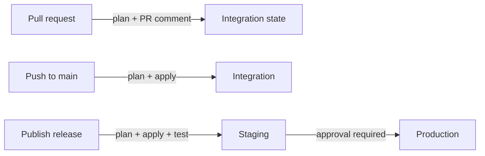

# Port resource promotion (Terraform)

Promote your Port configuration through environments the same way you ship code: review a plan on a pull request, apply to Integration on merge, and roll out to Staging then Production on release.

One committed Terraform root — `terraform/`, especially `generated.tf` — is the single source of truth. Every step plans and applies that same module, so what you review is exactly what gets promoted. There is no live export step in CI.

This implementation is built on the [Port Terraform provider](https://registry.terraform.io/providers/port-labs/port-labs/latest/docs), Terraform Cloud (state + workspace), and GitHub Actions.

## How it flows



| When you... | The pipeline... | Target | Jobs |
|---|---|---|---|
| Open a pull request | Plans the PR module against Integration state and posts the plan as a PR comment (no apply) | Integration | `plan-int` |
| Merge to `main` | Plans, then applies the saved plan | Integration | `plan-int`, `apply-int` |
| Run it manually (`workflow_dispatch`) | Plans, and applies only if you set the `apply` input to true | Integration | `plan-int`, `apply-int` |
| Publish a release | Plans, applies, and runs a convergence test | Staging | `plan-stg`, `apply-stg`, `test-stg` |
| ...after Staging passes | Plans and applies in one job, gated by a required reviewer | Production | `apply-prd` |

Integration and the release flow are independent — promoting to Staging/Production never reads Integration's live state. Each job checks out the repo at the ref that triggered it, so a release always promotes the config exactly as it was tagged: immutability comes from the git ref, not from the pipeline. Each plan is saved as a short-lived workflow artifact so the matching apply executes exactly the plan that was reviewed.

Production plans and applies inside a single job because production credentials are environment-scoped and cannot cross job boundaries. It runs only after `test-stg` succeeds *and* a required reviewer approves, so review the `plan-stg` and `test-stg` output before approving.

## What's in the box

This directory contains:

- [`.github/workflows/port-promote-terraform.yml`](.github/workflows/port-promote-terraform.yml) — the promotion pipeline.
- `.github/actions/terraform-setup` — validates credentials, derives the workspace name, installs Terraform.
- `.github/actions/terraform-workspace` — ensures a local-execution TFC workspace. The only step that mutates external infrastructure, and the only third-party action, isolated so both are auditable in one file.
- `.github/actions/terraform-init` — init, validate, and the `generated.tf` bootstrap gate.
- `.github/actions/terraform-plan` — plans and writes summaries (optional convergence mode).
- `.github/actions/terraform-apply` — applies a saved plan and writes summaries.
- [`terraform/`](terraform/) — Port provider module; commit your `generated.tf` here after bootstrap.

Every job calls them in the same order — `terraform-setup`, then `terraform-workspace`, then `terraform-init` — followed by `terraform-plan` and/or `terraform-apply` as that job requires. Each action does one thing and passes data through declared inputs and outputs rather than `GITHUB_ENV`, so you can lift any of them into a pipeline of your own.

## Prerequisites

- A Port account with [client credentials](https://docs.port.io/build-your-software-catalog/custom-integration/api/#get-api-token) for each target org (Integration, Staging, Production)
- [Terraform](https://developer.hashicorp.com/terraform/install) >= 1.15.0 installed locally (to bootstrap state)
- A Terraform Cloud organization where you can create one workspace and one team API token per environment
- [`terraform-import-generator`](https://github.com/port-experimental/terraform-import-generator) for the one-time bootstrap of `generated.tf`
- Admin access on the repo so you can create GitHub Environments

## Use it in your repo

Enabling this project inside a fork of this catalog instead? Copy only `.github/` to the repository root, leave `terraform/` where it is, and see the [repo README](../../../README.md) for that flow.

1. **Copy** or **merge** project `.github/` folder with the `.github/` folder at your repository root.
2. **Create GitHub Environments the correspond to the pipeline:** `integration`, `staging`, `production` (`sandbox` is reserved and not wired into any job yet — when you wire it up, inject its credentials from its own environment config rather than hardcoding them into the workflow).
   Environment names are just deployment stages — rename them to whatever convention your org uses. The Port org each stage targets is determined by its credentials (`PORT_CLIENT_ID` / `PORT_CLIENT_SECRET`), and is tied 1:1 to an Environment.
3. **Add protections:**
   - `integration` — no branch restriction (`plan-int` must run on `pull_request`). Optionally add required reviewers (see [PR-credential model](#pr-credential-model-and-accepted-risk)).
   - `staging` — restrict to release tags (e.g. `v*`).
   - `production` — required reviewers + release tags.
4. **In Terraform Cloud**, create one team + team API token per environment, each granted access to **only** that environment's workspace (`port-config-integration`, `port-config-staging`, `port-config-production` when using the default slug). Use each as that environment's `TF_API_TOKEN`.
5. **Configure each of `integration`, `staging`, and `production`** with:
   - Secrets: `PORT_CLIENT_SECRET`, `TF_API_TOKEN`
   - Variables: `PORT_CLIENT_ID`, `TFC_ORGANIZATION`
   - Optional: `PORT_BASE_URL` (defaults to `https://api.us.port.io`; set `https://api.port.io` for EU)
6. **Generate and commit** `terraform/generated.tf`, then bootstrap Integration state — see [First run](#first-run) below.
   - See [`terraform/README.md`](terraform/README.md) for the generator steps. Set `PORT_BASE_URL` for Terraform; `PORT_API_BASE_URL` is only needed when running `port-tf-import` (see [Port API URL](terraform/README.md#port-api-url)).
   - See [Troubleshooting](terraform/README.md#troubleshooting).

That's it. Merge to `main` promotes to Integration — you should see a plan run and an apply run for Integration under the Actions tab.
Publishing a release promotes through Staging to Production.

## First run

The first run is **red on purpose**, and you should not try to fix it.

Bootstrapping needs the Terraform Cloud workspace to already exist with `execution_mode=local`. `terraform.tf` uses a partial `cloud {}` block, and a workspace that `terraform init` auto-creates would default to *remote* execution — the wrong mode for this pipeline. So the workspace has to be provisioned before there is anything to plan.

Run the workflow via **workflow_dispatch** to do that. It derives the workspace name, installs Terraform, provisions `port-config-integration`, and runs `init` and `validate` — proving your credentials and state access work — then fails with a bootstrap notice in the job summary. Nothing was promoted, and nothing planned or applied against your Port org.

Then generate `generated.tf` against that workspace, remove the `*_imports.tf` files, and commit. Subsequent runs plan and apply normally.

Nothing downstream runs on that first attempt. A failed `terraform-init` skips the rest of its own job, which skips `apply-int`; on a release it cascades through `apply-stg`, `test-stg`, and `apply-prd`. That happens automatically because GitHub applies an implicit `success()` check to any `if:` that has no status function, so no extra gating is written into the workflow.

Only Integration can be bootstrapped this way, deliberately. `workflow_dispatch` targets Integration, while Staging and Production are restricted to release tags, so no manual run can reach them — their workspaces are created by the first release run.

## Auth and targeting

| Source | Variable / Secret | Used as |
|---|---|---|
| GitHub Environment | `PORT_CLIENT_ID`, `PORT_CLIENT_SECRET` | Port provider OAuth (`PORT_CLIENT_*` env) |
| GitHub Environment | `PORT_BASE_URL` (optional) | Port provider `base_url` (defaults to `https://api.us.port.io`; set `https://api.port.io` for EU) |
| GitHub Environment | `TF_API_TOKEN` | Terraform Cloud API + CLI credentials |
| GitHub Environment | `TFC_ORGANIZATION` | `TF_CLOUD_ORGANIZATION` |
| Workflow env | `TFC_WORKSPACE_SLUG` (`port-config`) | Base for `TF_WORKSPACE=${SLUG}-${environment}` |
| Workflow env | `TFC_WORKSPACE_TAGS` (`port-config`) | Tags applied when ensuring the TFC workspace |

Workflow env also sets `PORT_BETA_FEATURES_ENABLED=true` so generated page/folder resources can plan and apply. Workspaces use `execution_mode=local` so plan/apply run on the GitHub Actions runner while state lives in TFC.

No repository-level secrets are used. Every job references exactly one GitHub Environment and receives only that environment's credentials, which is what keeps a lower environment from reaching a higher one.

## PR-credential model and accepted risk

Unlike [`port-promote-port-cli`](../port-cli/) — whose committed JSON export lets a PR preview run as a credential-free file-vs-file diff — a real `terraform plan` must read live state (`TF_API_TOKEN`) and refresh through the Port provider (`PORT_CLIENT_*`). A credential-free live plan is therefore impossible.

As a result, `plan-int` runs on `pull_request` with the `integration` environment's secrets in scope, and that code is checked out from the PR ref (including `.github/actions/terraform-*/**`). This is an accepted risk, bounded by:

- **Forks excluded.** The `head.repo.full_name == github.repository` guard skips fork PRs, and GitHub withholds environment secrets from forks regardless.
- **Push access required.** Only collaborators who can open a same-repo branch PR can trigger it.
- **Workspace-scoped tokens.** With per-environment `TF_API_TOKEN`s, the worst case is exposure of the lowest environment's credentials, which cannot escalate to `staging`/`production`.
- **Optional gate.** Add required reviewers to the `integration` environment so a human approves before PR-authored code runs with secrets.

## CI plan timing and Port access-token TTL

CI plan/apply use `-parallelism=2`. GitHub-hosted runner egress is rate-limited more aggressively by Port than a local machine; default Terraform parallelism (10) can stall refreshes and fail mid-plan. Local runs can keep the default parallelism.

If you suspect throttling, add `PORT_DEBUG_RATE_LIMIT: "true"` to the workflow `env:` block and the Port provider will log when it is being rate-limited. It is a diagnostic, so remove it once you have your answer.

The Port Terraform provider authenticates **once** at configure time and **does not refresh** when the token expires. Port access tokens are short-lived; check the current TTL with:

```bash
curl -s -X POST "${PORT_BASE_URL}/v1/auth/access_token" \
  -H 'Content-Type: application/json' \
  -d "{\"clientId\":\"${PORT_CLIENT_ID}\",\"clientSecret\":\"${PORT_CLIENT_SECRET}\"}" \
  | jq '{expiresIn, tokenType, accessTokenLen: (.accessToken | length)}'
```

Treat `expiresIn` as a hard ceiling for GHA-hosted full refreshes until the provider re-auths on expiry.

## Make it yours

- **Add your own tests.** The `test-stg` job has an extension point — drop in API reachability checks, blueprint/action assertions, or any validation you need before Production is eligible.
- **Tune the workspace slug.** Change `TFC_WORKSPACE_SLUG` / `TFC_WORKSPACE_TAGS` in the workflow `env:` block if you want different TFC naming.
- **Tune the layout.** Two settings must agree on where the Terraform root module lives: the `TF_WORKING_DIRECTORY` default (overridable with a `TF_WORKING_DIRECTORY` repository variable) and the `on.push` / `on.pull_request` path filters. The workflow ships pointed at this catalog's nested layout, so it runs as-is from a fork. When this directory becomes your repository root, set `TF_WORKING_DIRECTORY` to `terraform` and the path filters to `terraform/**`.
- **Adjust the gates.** Environment protections are standard GitHub settings — tighten reviewers, branch/tag rules, or wait timers to match your org's release process.

## References

- [Port Terraform provider docs](https://registry.terraform.io/providers/port-labs/port-labs/latest/docs)
- [port-labs/terraform-provider-port-labs](https://github.com/port-labs/terraform-provider-port-labs)
- [port-experimental/terraform-import-generator](https://github.com/port-experimental/terraform-import-generator)
- [Port resource promotion (Port CLI)](../port-cli/)
